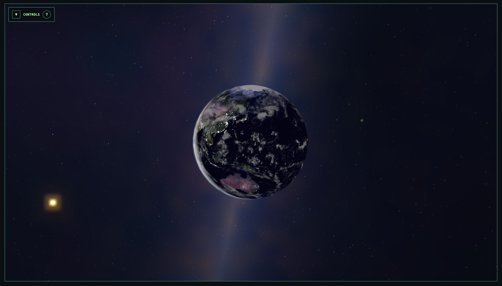

# Orrery

Minimal Vite + React + TypeScript app that renders a solar system visualization using real space geometry data from NAIF (NASA’s Navigation and Ancillary Information Facility).

[Live Demo](https://orrery.ryboso.me)

## Development

From repo root:

- `pnpm install`
- `pnpm run dev`

## NAIF kernels

This viewer ships a small set of **NAIF Generic Kernels** as static assets under `public/static/kernels/naif/`:

- `lsk/naif0012.tls` (LSK)
- `pck/pck00011.tpc` (PCK)
- `spk/planets/de432s.bsp` (SPK)

These kernel files are redistributed **unmodified**, consistent with NAIF's rules:
https://naif.jpl.nasa.gov/naif/rules.html

## Scripts

From repo root:

- `pnpm run format` (auto-format)
- `pnpm run format:check` (CI)
- `pnpm run lint`
- `pnpm run lint:fix`
- `pnpm run build`
- `pnpm run typecheck`
- `pnpm run test`

## Conventions

### Frames / world space

- Canonical world (inertial) frame: `J2000`.
- Handedness: follow SPICE conventions for the requested frame (for `J2000`, treat it as a right-handed inertial frame).

### Time

- `et` is **ephemeris time** in **seconds past the J2000 epoch**.
- In this codebase we represent it as a plain `number` (`EtSeconds`).

### Units

- Positions are expressed in **kilometers** (`positionKm`).
- Velocities are expressed in **kilometers per second** (`velocityKmPerSec`).
- Radii (for rendering) are expressed in **kilometers** (`radiusKm`).

### Scaling to renderer units

SPICE scales are huge for typical WebGL scenes.

- `1 threeUnit = 1,000,000 km` (`kmToWorld = 1 / 1_000_000`)

Tune this depending on camera near/far planes, desired look, and precision.

## Precision strategy

WebGL vertices end up in 32-bit float space; solar-system-scale positions (e.g. 1 AU in km) lose fine detail when used directly as world coordinates.

- Query body positions in a stable inertial frame (`J2000`) relative to a stable observer (we use `SUN`).
- Pick a **focus target** (defaults to Earth).
- Each update, compute delta between body and focus position.
- Convert delta into renderer units and assign to Three.js object positions.

### Frame transforms

`SpiceClient.getFrameTransform({ from, to, et })` returns a `Mat3` rotation matrix.

- Representation: a flat `number[9]` in **column-major** order to match Three.js `Matrix3`.
- Indexing:
  - `m = [
  m00, m10, m20,
  m01, m11, m21,
  m02, m12, m22
]`
  - This corresponds to columns `c0=(m00,m10,m20)`, `c1=(m01,m11,m21)`, `c2=(m02,m12,m22)`.

The transform is intended to be applied as:

- `v_to = M(from->to) * v_from`

## Visual regression testing

Playwright e2e tests live in `e2e`.

From repo root:

- `pnpm run e2e`
